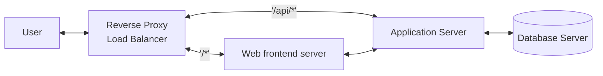

# How to setup a local VSCode development environment for a multi-tier-application

## Abstract

This article explains how to setup a VSCode development environment on a local machine to develop all tiers of a cloud-native application. The underlying scenario is a developer or a small team of developers of a small web-app, where each team member shall be able to run the full application stack (reverse proxy, frontend webserver, application server, database server) locally during development. The development environment uses [minikube](https://minikube.sigs.k8s.io).

VSCode development

Why local?

## What is a multi-tier-application?



This documentation is based on the following [Example App](https://github.com/hbollon/k8s-voting-app-aws/tree/main/k8s-specifications).

## Prerequisites

### Create a project directory structure

```text
├── <project_dir>
│   ├── devenv-pod.yaml
│   ├── database-server.env
│   ├── 
│   ├── frontend-webserver   <-- folder for source code of web frontend (VSCode workspace)
│   │   ├── .devcontainer    <-- VSCode relevant folder with workspace description
│   │   │   ├── Dockerfile
│   │   │   ├── devcontainer.json
│   │   ├── ...
│   ├── application-server   <-- folder for source code of application backend (VSCode workspace) 
│   │   ├── .devcontainer    <-- VSCode relevant folder with workspace description
│   │   │   ├── Dockerfile
│   │   │   ├── devcontainer.json
│   │   ├── ...
│   ├── database-server      <-- folder with local database storage (files)
│   │   ├── ...
│   ├── Docker               <-- all container images for development and production deployment (not for dev-build environment)
│   │   ├── dev
│   │   │   ├── frontend-webserver.Dockerfile
│   │   │   ├── application-server.Dockerfile

│   │   ├── prod
│   │   │   ├── frontend-webserver.Dockerfile
│   │   │   ├── application-server.Dockerfile

│   ├── helm                 <-- folder with helm templates and configuration values
│   │   ├── cloudcell-stack
│   │   │   ├── Chart.yaml
│   │   │   ├── values-prod.yaml  <-- configuration values for production deployments
│   │   │   ├── values-dev.yaml   <-- configuration values for local development deployment
│   │   │   ├── .helmignore
│   │   │   ├── templates
│   │   │   │   ├── app-ingress.yaml
│   │   │   │   ├── app-namespace.yaml
│   │   │   │   ├── application-server-deploy.yaml
│   │   │   │   ├── application-server-service.yaml
│   │   │   │   ├── frontend-webserver-deploy.yaml
│   │   │   │   ├── frontend-webserver-service.yaml
│   │   │   │   ├── database-deploy.yaml
│   │   │   │   ├── database-service.yaml
```

Start minikube Kubernetes cluster

```bash
minikube start
minikube status
kubectl get pods -A
minikube addons enable ingress
```

## Configure docker

Use the `minikube docker-env` command that outputs environment variables needed to point the local Docker daemon to the minikube internal Docker registry:
[Ref](https://medium.com/swlh/how-to-run-locally-built-docker-images-in-kubernetes-b28fbc32cc1d)

```bash
eval $(minikube -p minikube docker-env)
```

## Application server

docker-file for application server

```dockerfile
# [Choice] Python version (use -bullseye variants on local arm64/Apple Silicon): 3, 3.10, 3.9, 3.8, 3.7, 3.6, 3-bullseye, 3.10-bullseye, 3.9-bullseye, 3.8-bullseye, 3.7-bullseye, 3.6-bullseye, 3-buster, 3.10-buster, 3.9-buster, 3.8-buster, 3.7-buster, 3.6-buster
ARG VARIANT="3.9-bullseye"
FROM mcr.microsoft.com/vscode/devcontainers/python:0-${VARIANT}

# Install dependency/virtual-environment-management tool
RUN /usr/local/bin/python3 -m pip install --upgrade pip
RUN pip install poetry
# RUN curl -sSL https://raw.githubusercontent.com/python-poetry/poetry/master/get-poetry.py | python -
RUN poetry config virtualenvs.create true
RUN poetry config virtualenvs.in-project true
```

```bash
docker build -f ./application-server/.devcontainer/Dockerfile -t application-server .
```

## Frontend webserver

```dockerfile
# [Choice] Node.js version (use -bullseye variants on local arm64/Apple Silicon): 16, 14, 12, 16-bullseye, 14-bullseye, 12-bullseye, 16-buster, 14-buster, 12-buster
ARG VARIANT="16-bullseye"
FROM mcr.microsoft.com/vscode/devcontainers/typescript-node:0-${VARIANT}
```

```bash
docker build -f ./frontend-webserver/.devcontainer/Dockerfile -t frontend-webserver .
```

## Namespace

Create new namespace for all elements of the environment and set it as default:

```bash
kubectl create namespace cloudcell-stack
kubectl config set-context $(kubectl config current-context) --namespace cloudcell-stack
```

## Secrets

Create `database-server.env` and secrets
[Xxx](https://stackoverflow.com/questions/64872206/create-kubernetes-env-var-secrets-from-env-file)

```bash
POSTGRES_USER=postgres
POSTGRES_PASSWORD=<some_password>
POSTGRES_DB=cloudcell-db
POSTGRES_HOST_AUTH_METHOD=trust
```

```bash
kubectl create secret generic database-server-env --from-env-file=database-server.env
```

Verify secret

```bash
kubectl get secret database-server-env -o yaml
```

## Deployment

Update Helm repositories and download dependencies:

```bash
helm dependency update ./helm/cloudcell-stack
```

Potentially debug the Helm Charts:

```bash
helm lint ./helm/cloudcell-stack
helm template --debug cloudcell-stack ./helm/cloudcell-stack
```

Deploy the Helm Chart:

```bash
helm template cloudcell-stack ./helm/cloudcell-stack | kubectl apply -f -
```

## Check Deployment

Get your cluster IP:

```bash
minikube ip
```

List pods

```bash
kubectl get pods -A
```

You can keep an eye on the pod being created with:

```bash
kubectl get pods -A --watch
```

Check POD debug logs

```bash
kubectl describe --namespace=cloudcell-stack pod <name-from-get-pods-A>
kubectl logs --previous --tail 10 --namespace=cloudcell-stack -p <name>
```

Nachdem das Addon aktiviert wurde, führen Sie bitte "minikube tunnel" aus, dann sind ihre Resourcen über "127.0.0.1" erreichbar

## Destroy deployment

To stop and destroy all k8s deployed resources run:

```bash
helm template cloudcell-stack ./helm/cloudcell-stack --namespace=cloudcell-stack | kubectl delete -f -
minikube stop
```


minikube tunnel ??


kubectl apply -f k8s-specifications --namespace=cloudcell-stack
kubectl delete -f k8s-specifications --namespace=cloudcell-stack
minikube stop


Using Helm Chart

    Update Helm repositories and download dependencies: helm dependency update ./helm/voting-app
    Deploy the Helm Chart: helm template voting-app ./helm/voting-app --namespace=voting-app-stack | kubectl apply -f -
    Get your cluster IP using: minikube ip
    Enable ingress access:
        On Linux: Edit your hosts file located at /etc/hosts by adding <minikube ip> result.votingapp.com vote.votingapp.com to the end of it, of course replace <minikube ip> by the real cluster ip.
        On Windows: Edit your hosts file located at c:\Windows\System32\Drivers\etc\hosts by adding 127.0.0.1 result.votingapp.com vote.votingapp.com to the end of it. After that, start a Minikube tunnel: minikube tunnel

The result app should be now accessible through result.votingapp.com and the vote one to vote.votingapp.com To stop and destroy all k8s deployed ressources run: helm template voting-app ./helm/voting-app --namespace=voting-app-stack | kubectl delete -f - and stop minikube using minikube stop


Cluster manifest

<!--- cSpell:disable --->
```yaml
# devenv-pod.yml
apiVersion: v1
kind: Pod
metadata:
  name: devenv-pod
  labels:
    app: app
spec:
  containers:

  - image: frontend-webserver
    # https://kubernetes.io/docs/concepts/containers/images/#image-pull-policy
    imagePullPolicy: Never
    name: frontend-webserver-container
    securityContext:
      runAsUser: 1000
      runAsGroup: 1000
      #fsGroup: 2000
    command: ["/bin/sh", "-c", "while sleep 1000; do :; done"]
    volumeMounts:
    - mountPath: /workspace
      name: frontend-webserver-code-volume
    - mountPath: /home/vscode/.cache
      name: frontend-webserver-cache-volume

- image: application-server
    # https://kubernetes.io/docs/concepts/containers/images/#image-pull-policy
    imagePullPolicy: Never
    name: application-server-container
    securityContext:
      runAsUser: 1000
      runAsGroup: 1000
      #fsGroup: 2000
    command: ["/bin/sh", "-c", "while sleep 1000; do :; done"]
    volumeMounts:
    - mountPath: /workspace
      name: application-server-code-volume
    - mountPath: /home/vscode/.cache
      name: application-server-cache-volume

  - name: postgres
    # https://hub.docker.com/_/postgres/
    image: postgres:latest
    ports:
      - containerPort: 5432
    envFrom:
      - secretRef:
          name: database-server-env
    volumeMounts:
      - mountPath: /var/lib/postgresql/data
        name: database-server-volume

  volumes:
  - name: frontend-webserver-code-volume
    hostPath:
      # location of your code on the host; on Linux this is the actual directory:
      path: <path_to_project_dir>/frontend-webserver

      # On Windows with docker for desktop, it's MOAR COMPLICATED:
      # - bind mount on the WSL2 image:
      #    sudo mount --bind /bleh/bleh/dbwriter_python /mnt/wsl/dbwriter_python
      # - this maps to:
      #   /run/desktop/mnt/host/wsl/... for docker and kubernetes
      #   see https://github.com/docker/for-win/issues/5325#issuecomment-567594291
      #   (on docker-desktop wsl2 image, I can only see it as /mnt/host/wsl/... )
      # path: /run/desktop/mnt/host/wsl/dbwriter_python

      # this field is optional
      type: Directory

  - name: frontend-webserver-cache-volume
    # same as lifetime of the pod; OK for caching of python package installs and so on
    # https://kubernetes.io/docs/concepts/storage/volumes/#emptydir
    emptyDir: {}


  - name: application-server-code-volume
    hostPath:
      # location of your code on the host; on Linux this is the actual directory:
      path: <path_to_project_dir>/application-server
      # this field is optional
      type: Directory


  - name: application-server-cache-volume
    # same as lifetime of the pod; OK for caching of python package installs and so on
    # https://kubernetes.io/docs/concepts/storage/volumes/#emptydir
    emptyDir: {}

  - name: database-server-volume
    hostPath:
      # location of your code on the host; on Linux this is the actual directory:
      path: <path_to_project_dir>/database-server
      # this field is optional
      type: Directory

---

apiVersion: v1
kind: Service
metadata:
  name: my-service
spec:
  type: NodePort
  selector:
    app: app
  ports:
    - protocol: TCP
      # cluster applications can come in via this port
      port: 8000
      # traffic will be forwarded to pods with label "app" on this port
      targetPort: 8000
      # connect to this port on the machine hosting the cluster node
      nodePort: 30080
```
<!--- cSpell:enable --->

Configuring the cluster

<!---```bash
kubectl create namespace devenv
kubectl config set-context $(kubectl config current-context) --namespace devenv
kubectl apply -f devenv-pod.yml
kubectl get pods --watch
```--->


Run with Kubernetes
Minikube

Before deploying the app, you must install Minikube and start a cluster:

    Install Minikube
    Start a Minikube cluster: minikube start
    Check that Minikube is fully up (minikube status) and kubectl successfully linked (kubectl get pods -A)
    Enable Nginx Ingress Controller addon: minikube addons enable ingress

Using k8s templates

    Deploy all k8s ressources: kubectl apply -f k8s-specifications --namespace=voting-app-stack
    Get your cluster IP using: minikube ip
    Enable ingress access:
        On Linux: Edit your hosts file located at /etc/hosts by adding <minikube ip> result.votingapp.com vote.votingapp.com to the end of it, of course replace <minikube ip> by the real cluster ip.
        On Windows: Edit your hosts file located at c:\Windows\System32\Drivers\etc\hosts by adding 127.0.0.1 result.votingapp.com vote.votingapp.com to the end of it. After that, start a Minikube tunnel: minikube tunnel

The result app should be now accessible through result.votingapp.com and the vote one to vote.votingapp.com To stop and destroy all k8s deployed ressources run: kubectl delete -f k8s-specifications --namespace=voting-app-stack and stop minikube using minikube stop

Summary
